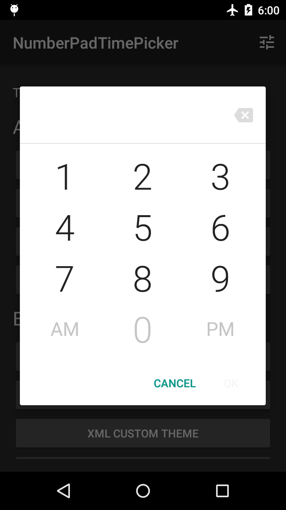
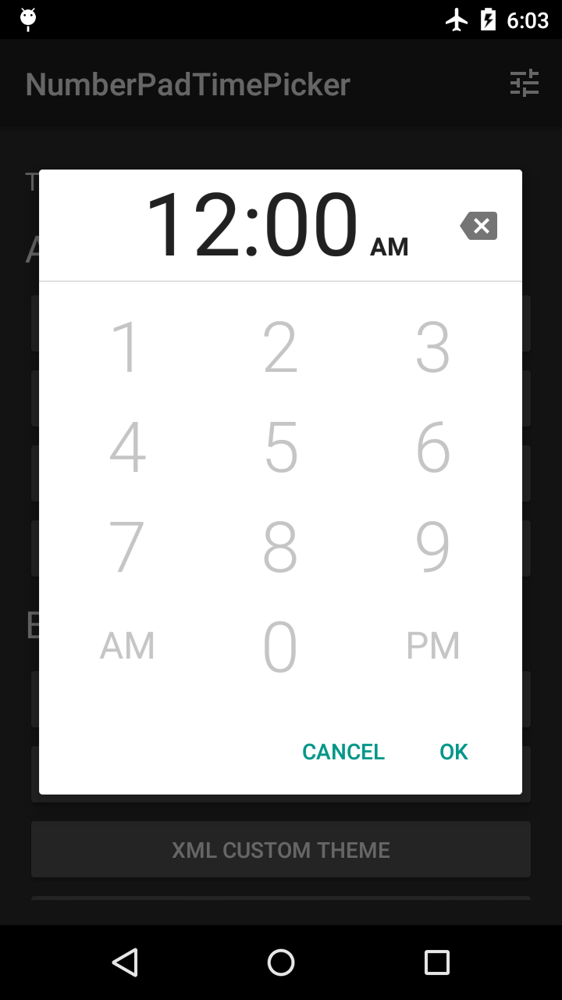
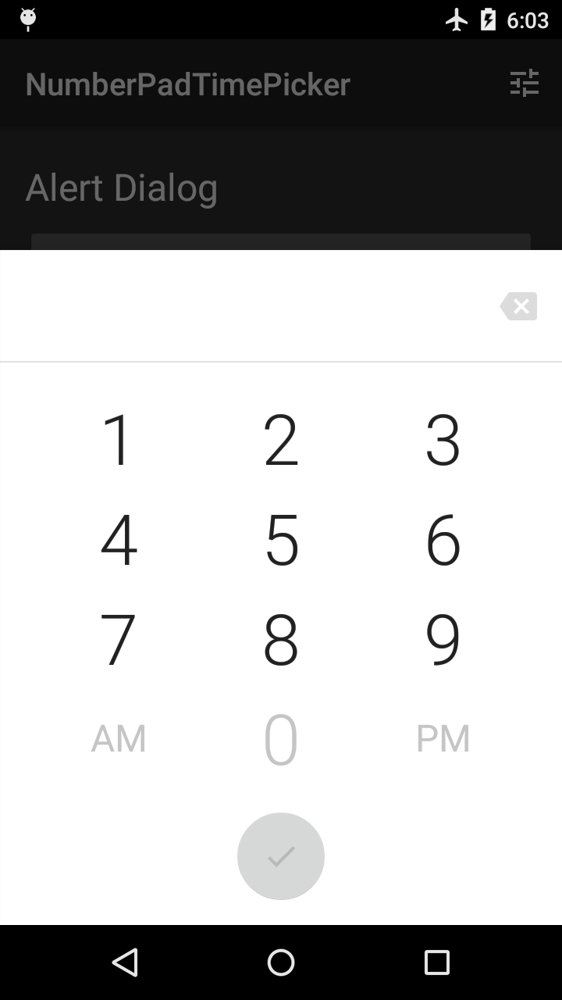
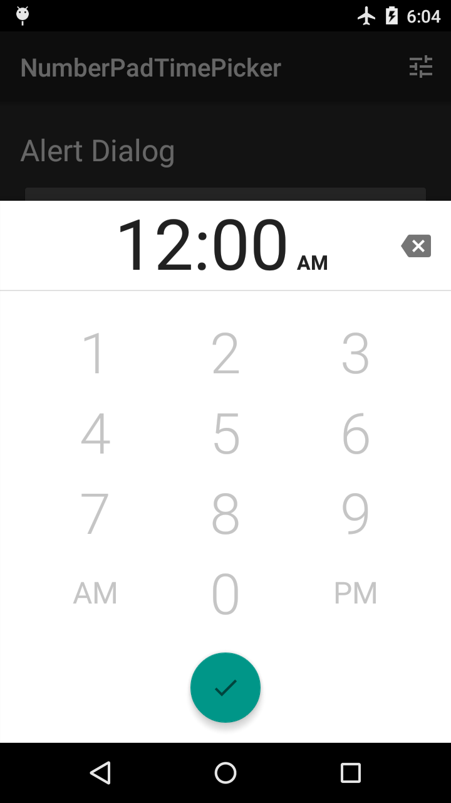

# NumberPadTimePicker

Make time selections in Android by typing them.

As you type or remove digits, number keys and the "OK" button are enabled or disabled to prevent
you from setting invalid times. The time separator (e.g. ":") character is dynamically formatted 
into the correct position.

Available as an alert dialog, a bottom sheet dialog, and as a plain `View`.

   

1. [Sample App](#sample-app)
2. [Installation](#installation)
3. [Usage](#usage)
    1. [Use as Dialog]
    2. [Use as View](#use-as-view)
        1. [Define an OK Button](#define-an-ok-button)
        2. [Register OK Button Callbacks](#register-ok-button-callbacks)
4. [Themes and Styles]
5. [Contributing](#contributing)
6. [License](#license)

## Sample App

The sample app demos some built-in themes. You can also dynamically customize your own theme with a
limited color palette.

<a href='https://play.google.com/store/apps/details?id=com.philliphsu.numberpadtimepickersample&pcampaignid=MKT-Other-global-all-co-prtnr-py-PartBadge-Mar2515-1'></a>

[Source code](/sample)

## Installation

```groovy
allprojects {
    repositories {
        maven { url 'https://jitpack.io' }
    }
}

dependencies {
    compile 'com.github.philliphsu:numberpadtimepicker:1.1.1'
}
```

## Usage

### Use as Dialog

Implement the `android.app.TimePickerDialog.OnTimeSetListener` interface.

```java
// The TimePicker returned in this callback is a dummy object. It is not
// the actual NumberPadTimePicker used by this library.
@Override
public void onTimeSet(TimePicker view, int hourOfDay, int minute) {
    // Do something with the time chosen by the user
}
```

Obtain an instance of [`NumberPadTimePickerDialog`] or [`BottomSheetNumberPadTimePickerDialog`]. 
You may pass in an optional style resource to use as the dialog's theme. Alternatively, you can 
theme the dialog programmatically after you've obtained an instance. See [Themes and Styles] for a 
guide to styling the dialog.

```java
NumberPadTimePickerDialog dialog = new NumberPadTimePickerDialog(
    context, R.style.MyNptpAlertDialogTheme, listener, is24HourMode);

BottomSheetNumberPadTimePickerDialog dialog = new BottomSheetNumberPadTimePickerDialog(
    context, R.style.MyNptpBottomSheetDialogTheme, listener, is24HourMode);
```

If you want to use the dialog in a `DialogFragment`, use the support library's
`android.support.v4.app.DialogFragment`. See the [Pickers guide] for more information.

### Use as View

> Using [`NumberPadTimePicker`] as a `View` requires more care to ensure it is sized appropriately
in your layouts. As of version 1.1.0, [`NumberPadTimePicker`] is not optimized for small screen 
heights (for example, in landscape). If you are affected by this, you'll need to account for this
in a way that is appropriate for your use case.

Add a [`NumberPadTimePicker`] to your layout like any other `View`. However, by itself, it is not 
very useful as a widget for time input.

#### Define an OK Button

For a [`NumberPadTimePicker`] to actually be useful for time input, you need to define an "OK" 
button somewhere in your screen. For example, this can be a `View` in your layout or a 
`MenuItem` in your app bar.

For your convenience, this library provides ready-to-use "OK" buttons you can add to the 
[`NumberPadTimePicker`] instead of defining your own. These are the same buttons that are used
in the dialogs.

In your XML layout, specify the `nptp_numberPadTimePickerLayout` attribute on your 
[`NumberPadTimePicker`] with one of these values:

##### Table 1. Values for the `nptp_numberPadTimePickerLayout` attribute
Value       | Description
------------|--------------------------------------------------------------------------------------
standalone  | The default value. No additional views will be added to the `NumberPadTimePicker`.
alert       | Adds alert-style action buttons ("Cancel", "OK") to the `NumberPadTimePicker`.
bottomSheet | Adds a `FloatingActionButton` to the `NumberPadTimePicker`.

```xml
<com.philliphsu.numberpadtimepicker.NumberPadTimePicker
    xmlns:app="http://schemas.android.com/apk/res-auto"
    app:nptp_numberPadTimePickerLayout=["standalone" | "alert" | "bottomSheet"]
    ... 
    />
```

#### Register OK Button Callbacks

```java
View okButton = ...

NumberPadTimePicker timePicker = ...
timePicker.setOkButtonCallbacks(new NumberPadTimePicker.OkButtonCallbacks() {
    @Override
    public void onOkButtonEnabled(boolean enabled) {
        // If you are using the provided OK buttons, you do not need to do anything.
        okButton.setEnabled(enabled);
    }

    @Override
    public void onOkButtonClick(NumberPadTimePicker view, int hourOfDay, int minute) {
        // Do something with the time chosen by the user
    }
});

// If you are using the provided OK buttons, you do not need to set this.
okButton.setOnClickListener(new View.OnClickListener() {
    @Override
    public void onClick(View v) {
        timePicker.confirmTimeSelection();  // Calls your onOkButtonClick() callback
    }
});
```

If you are using the `alert` layout, you may also want to set a click listener on the provided 
cancel button:
 
```java
timePicker.setCancelButtonClickListener(new View.OnClickListener() {
    @Override
    public void onClick(View v) {
        // Respond to cancel click 
    }
});
```

## Themes and Styles

This section describes how to style the [`NumberPadTimePicker`] view, which is used in the dialogs 
and is available to use in your own layouts.

You can style the view in XML or in code.

[`NumberPadTimePickerDialog`], [`BottomSheetNumberPadTimePickerDialog`], and the 
[`NumberPadTimePicker`] view all have a method called `getThemer()`. This returns an object allowing
you to theme the time picker in code by chaining setters.

There are two return types to be aware of: [`NumberPadTimePickerThemer`] and 
[`BottomSheetNumberPadTimePickerThemer`].

* [`NumberPadTimePickerDialog`] returns a [`NumberPadTimePickerThemer`].
* [`BottomSheetNumberPadTimePickerDialog`] returns a [`BottomSheetNumberPadTimePickerThemer`].
* [`NumberPadTimePicker`] returns a [`NumberPadTimePickerThemer`], which can possibly be 
casted to [`BottomSheetNumberPadTimePickerThemer`].

The following table lists styleable attributes available in all [layouts][Table 1]. These correspond
to setters in [`NumberPadTimePickerThemer`].

### Table 2. Common styleable attributes

Attribute                | Description
-------------------------|------------------------------------------------------------------------
nptp_numberPadTimePickerLayout | Determines the presence and appearance of additional dialog buttons. See [Table 1] for possible values.
nptp_inputTimeTextColor  | Text color for the inputted time in the header.
nptp_inputAmPmTextColor  | Text color for the inputted AM/PM in the header.
nptp_backspaceTint       | Tint to apply to the backspace icon. This should be a color state list with enabled and disabled states.
nptp_numberKeysTextColor | Text color for the number keys. This should be a color state list with enabled and disabled states.
nptp_altKeysTextColor    | Text color for the "AM"/"PM" keys in 12-hour mode or the ":00"/":30" keys in 24-hour mode. This should be a color state list with enabled and disabled states.
nptp_headerBackground    | Background of the header containing the inputted time and AM/PM. This can be a color or a drawable.
nptp_divider             | Divider separating the header from the number pad. This can be a color or a drawable.
nptp_numberPadBackground | Background of the number pad. This can be a color or a drawable.
nptp_is24HourMode        | Whether the number pad should use 24-hour mode.

The following table lists styleable attributes available only for the `bottomSheet` layout.
These correspond to setters in [`BottomSheetNumberPadTimePickerThemer`].

### Table 3. Bottom sheet styleable attributes

Attribute                      | Description
-------------------------------|------------------------------------------------------------------
nptp_fabBackgroundColor        | Background color of the `FloatingActionButton`. This should be a color state list with enabled and disabled states.
nptp_animateFabBackgroundColor | Whether the `FloatingActionButton` should transition between its enabled and disabled colors. Does not apply if `nptp_showFab` is set to `validTime`.
nptp_fabRippleColor            | Ripple color of the `FloatingActionButton` when pressed.
nptp_animateFabIn              | Whether the `FloatingActionButton` should animate onto the screen when the dialog is shown. Does not apply if `nptp_showFab` is set to `validTime`.
nptp_showFab                   | Indicates when the `FloatingActionButton` should be shown. Either `always` or `validTime`.
nptp_backspaceLocation         | Location of the backspace key. Either `header` or `footer`.
nptp_fabIconTint               | Tint to apply to the icon in the `FloatingActionButton`. This should be a color state list with enabled and disabled states.

If you are using [`NumberPadTimePicker`] in your own layouts, you may find it convenient to specify
one of the following styles. These styles adjust `layout_width` and `layout_height` for multiple 
size qualifiers.

* `NPTP_NumberPadTimePickerStandaloneStyle_FillHeight`
* `NPTP_NumberPadTimePickerStandaloneStyle_ExactHeight`
* `NPTP_NumberPadTimePickerAlertStyle_FillHeight`
* `NPTP_NumberPadTimePickerAlertStyle_ExactHeight`
* `NPTP_NumberPadTimePickerBottomSheetStyle_FillHeight`
* `NPTP_NumberPadTimePickerBottomSheetStyle_ExactHeight`

```xml
<com.philliphsu.numberpadtimepicker.NumberPadTimePicker
    style="@style/NPTP_NumberPadTimePickerStandaloneStyle_FillHeight"
    ... 
    />
```

You can create a theme for a dialog or `Activity` that uses [`NumberPadTimePicker`].

Create a style resource using the attributes in [Table 2] and [Table 3]. There are default 
style resources that you may inherit from:

* `NPTP_Base_NumberPadTimePickerStandaloneStyle`
* `NPTP_Base_NumberPadTimePickerAlertStyle`
* `NPTP_Base_NumberPadTimePickerBottomSheetStyle`

Set this style resource in your theme using the `nptp_numberPadTimePickerStyle` attribute.

```xml
<style name="MyNptpAlertStyle" parent="NPTP_Base_NumberPadTimePickerAlertStyle">
    ...
</style>

<style name="MyNptpAlertDialogTheme" parent="Theme.AppCompat.Dialog.Alert">
    <item name="nptp_numberPadTimePickerStyle">@style/MyNptpAlertStyle</item>
</style>

<style name="MyNptpBottomSheetStyle" parent="NPTP_Base_NumberPadTimePickerBottomSheetStyle">
    ...
</style>

<style name="MyNptpBottomSheetDialogTheme" parent="Theme.Design.BottomSheetDialog">
    <item name="nptp_numberPadTimePickerStyle">@style/MyNptpBottomSheetStyle</item>
</style>
```

Obtain an instance of the dialog as described in [Use as Dialog]. If you don't want to pass
the theme to the dialog's constructor, you can instead specify it in your `Activity`'s theme.

```xml
<style name="AppTheme" parent="Theme.AppCompat">
    <item name="nptp_numberPadTimePickerAlertDialogTheme">@style/MyNptpAlertDialogTheme</item>
    <item name="nptp_numberPadTimePickerBottomSheetDialogTheme">@style/MyNptpBottomSheetDialogTheme</item>
</style>
```

## Contributing

Contributions are welcome. In particular, contributions to optimize dimensions for any form factor 
or to improve localization are appreciated. Send pull requests to the `develop` branch. If you think 
something could look better, feel free to let me know your thoughts.

## License

```
Copyright 2017 Phillip Hsu

Licensed under the Apache License, Version 2.0 (the "License");
you may not use this file except in compliance with the License.
You may obtain a copy of the License at

    http://www.apache.org/licenses/LICENSE-2.0

Unless required by applicable law or agreed to in writing, software
distributed under the License is distributed on an "AS IS" BASIS,
WITHOUT WARRANTIES OR CONDITIONS OF ANY KIND, either express or implied.
See the License for the specific language governing permissions and
limitations under the License.
```

[pickers guide]: https://developer.android.com/guide/topics/ui/controls/pickers.html#TimePicker
[Themes and Styles]: #themes-and-styles
[Use as Dialog]: #use-as-dialog
[Table 1]: #table-1-values-for-the-nptp_numberpadtimepickerlayout-attribute
[Table 2]: #table-2-common-styleable-attributes
[Table 3]: #table-3-bottom-sheet-styleable-attributes
[`NumberPadTimePickerDialog`]: library/src/main/java/com/philliphsu/numberpadtimepicker/NumberPadTimePickerDialog.java
[`BottomSheetNumberPadTimePickerDialog`]: library/src/main/java/com/philliphsu/numberpadtimepicker/BottomSheetNumberPadTimePickerDialog.java
[`NumberPadTimePicker`]: library/src/main/java/com/philliphsu/numberpadtimepicker/NumberPadTimePicker.java
[`NumberPadTimePickerThemer`]: library/src/main/java/com/philliphsu/numberpadtimepicker/NumberPadTimePickerThemer.java
[`BottomSheetNumberPadTimePickerThemer`]: library/src/main/java/com/philliphsu/numberpadtimepicker/BottomSheetNumberPadTimePickerThemer.java